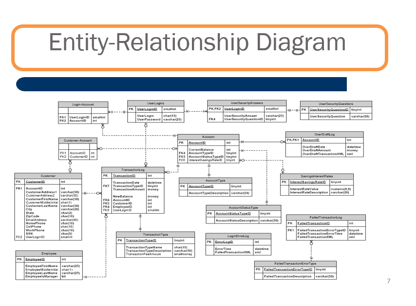

# Database-Design

### Introduction

There are only two types of accounts at this time: Checking and Savings accounts. The provided column list was separated into appropriate entities (tables) with relationships between these entities defined. 
I picked the appropriate data types for each of the columns, established data integrity rules by defining primary key, secondary key and some unique constraints.

### Tool

MySQL Workbench

### Entity Relationship Diagram
The ER diagram was used to build the database.



### Query Samples
```
CREATE DATABASE Bank; 

CREATE TABLE UserLogins
(
UserLoginID    smallint primary key,
Userlogin      char(15),
UserPassword   varchar(20)
)

ALTER TABLE  LoginAccount
ADD CONSTRAINT FK_UserLoginsLoginAccount
FOREIGN KEY (UserLoginID) REFERENCES UserLogins(UserLoginID);
```


### Challenges/Lessons

Some of the data types listed in the E-R Diagram were causing errors when running the code. For example data types smallmoney, and bit.
So I changed data type "smallmoney" to 'decimal' and bit to 'boolean' to fix the issue.
